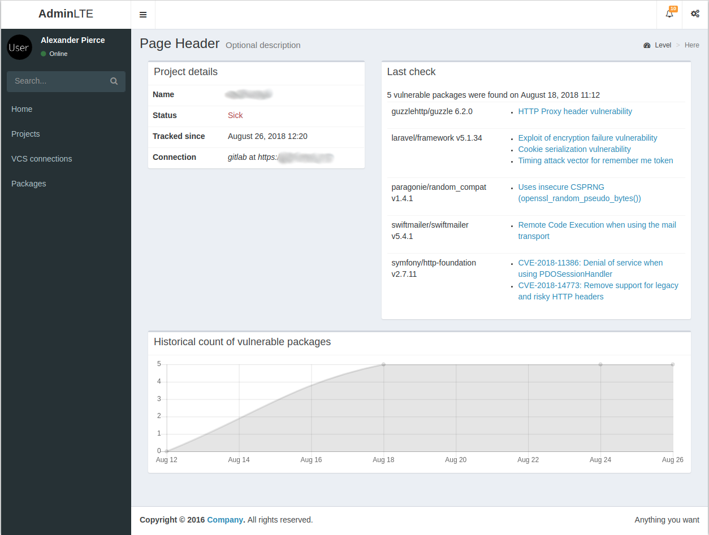

# Security Monitor

Your go to for monitoring security of your apps dependencies.


## Features

* Connect to GitHub/GitLab with your personal token
* Track projects your personal access token has access to
* more coming, see todo list at the bottom

### Project overview

On this page you can see the list of current vulnerabilities along with historical chart of their amount.



## Setting up

> Assuming that you have [dory](https://github.com/FreedomBen/dory) with SSL certs stored in `~/.dinghy/certs` `https` will work out of the box.

1. If you don't have `dory` installed add the following to `nginx` container definition in `docker-compose.yml`:

```yaml
ports:
    - 10080:80
```

2. Run `make init`
  
  
  
If you have `dory`, you can access the application on [www.security.dev](https://www.security.dev)
If you don't, go to [localhost:10080](http://localhost:10080)

## TODO list

- [ ] Github/Gitlab webhook support
- [ ] running checks on schedule
- [ ] API for e.g. Icinga
- [ ] secure storage of VCS credentials
- [ ] authentication - SensioLabs Connect is implemented, more to come
- [ ] authorization
- [ ] closer integration with Github APIs (Checks API maybe?)
- [x] list of packages installed per application with versions
- [x] list of applications using a given package
- [x] historical stats about vulnerable packages in project
